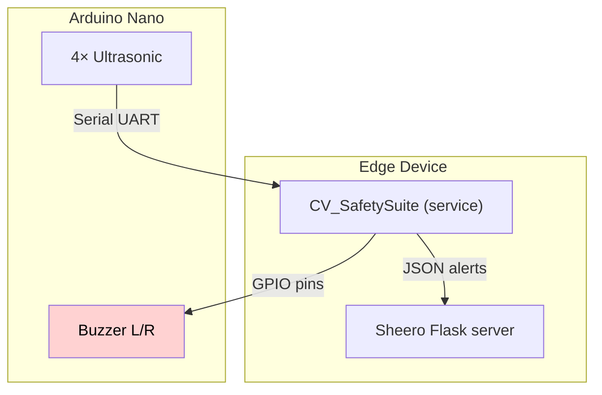

# SentinelDrive 🚗💡 – The Ultimate AI‑Powered Driver Safety Suite

> **“Enhancing human reflexes with silicon instincts.”**


[](…)
[](LICENSE)
[](https://www.python.org/)
[](https://www.arduino.cc/)

---

## ✨ TL;DR

SentinelDrive fuses **Computer‑Vision steering analysis**, **ultrasonic blind‑spot detection**, and a **voice‑activated AI co‑pilot (Sheero)** into a single open‑source stack.  It watches the road, senses obstacles, keeps an eye on driver well‑being, *and* chats back using a local LLM – all in < 80 W on a Raspberry Pi 5 + Arduino Nano.

<table>
<tr><th align="center">👁️ CV_SafetySuite</th><th align="center">🔊 Sheero AI Assistant</th><th align="center">📡 Arduino Blind‑Spot Module</th></tr>
<tr><td valign="top"><ul><li>Drowsiness, drunk, stress & steering detection</li><li>Real‑time <code>&lt;35 ms</code> inference on Pi GPU</li><li>EAR, head‑pose &amp; HSV tracking pipelines</li></ul></td><td valign="top"><ul><li>Wake‑word “gogi” + fast Vosk ASR</li><li>Context‑aware tips via local <strong>Mistral‑7B</strong></li><li>Glowing Web dashboard with animations</li></ul></td><td valign="top"><ul><li>4× HC‑SR04 ultrasonic sensors per flank</li><li>&lt;100 cm proximity buzzer alerts</li><li>CAN‑Bus‑style serial to Pi controller</li></ul></td></tr>
</table>


---

## 📚 Table of Contents

1. [Features](#features)
2. [Architecture](#architecture)
3. [Quick Start](#quick-start)
4. [Directory Layout](#directory-layout)
5. [Roadmap](#roadmap)
6. [Contributing](#contributing)
7. [License](#license)

---

## 🚀 Features <a name="features"></a>

### 1. Computer‑Vision Safety Suite

* **Steering intent** via colour‑tracked steering‑wheel markers.
* **Drowsiness** (EAR < 0.18 for >2 s) & **head‑bow shake** >60 px detect fatigue or impairment.
* **Stress cues** captured with Vosk keyword spotting & amplitude spikes.
* Modular OpenCV pipeline – runs as a ROS 2 node.

### 2. Blind‑Spot Sentinel

* Dual flanks instrumented with **4× HC‑SR04** sensors scanning every 500 ms.
* Turn‑signal + distance <100 cm → *directional* buzzer.  False‑positives squashed by conjunctive logic.

### 3. Sheero – Voice AI Co‑Pilot

* Hands‑free wake‑word **“gogi”** and 10 s natural‑language command window.
* Local **Mistral** model (via [Ollama](https://github.com/jmorganca/ollama)) serves hyper‑concise driving advice.
* Flask + WebSocket dashboard with live wave/orbit/pulse animations & alert LEDs.
* Safety‑first prompt engineering ensures *<20‑word* actionable cues.

---

## 🧩 Architecture <a name="architecture"></a>



---

## ⚡️ Quick Start <a name="quick-start"></a>

```bash
# 1) Clone & submodules
$ git clone https://github.com/your‑org/sentineldrive.git && cd sentineldrive

# 2) Python env
$ python3 -m venv .venv && source .venv/bin/activate
$ pip install -r requirements.txt  # OpenCV, Vosk, gTTS, Pygame, Flask…

# 3) Install Ollama + pull local model
$ curl https://ollama.ai/install.sh | sh
$ ollama pull mistral

# 4) Flash the Arduino sketch (see firmware/)
$ arduino-cli upload -p /dev/ttyUSB0 -b arduino:avr:nano firmware/blindspot.ino

# 5) Run everything
$ python src/VoiceAssistant.py  # spawns CV & dashboard workers automatically
```

> **Tip:** For headless operation, use `tmuxp load dev.tmuxp.yaml`.

---

## 🗂 Directory Layout <a name="directory-layout"></a>

```
.
├── src/
│   ├── CV_SafetySuite.ipynb   # Jupyter prototype – convert to .py for prod
│   ├── VoiceAssistant.py      # Sheero AI assistant
│   └── modules/              # Reusable OpenCV & signal helpers
├── firmware/
│   └── blindspot.ino         # Arduino Nano sketch
├── docs/
│   ├── assets/               # Diagrams, banners, demo GIFs
│   └── SentinelDrive.pdf     # Full project write‑up / slides
└── tests/                    # PyTest‑powered CICD smoke tests
```

---

## 🗺 Roadmap <a name="roadmap"></a>

* [ ] Replace HSV steering detection with **MediaPipe Hands**.
* [ ] Integrate **LiDAR** for rear cross‑traffic.
* [ ] Migrate from Vosk to **Whisper.cpp** for multilingual commands.
* [ ] OTA updates via **Fly.io** edge‑deployments.

---

## 🤝 Contributing <a name="contributing"></a>

1. Fork ➜ Feature branch ➜ PR (with screenshot/GIF).
2. Run `pre‑commit run ‑‑all-files` (black, isort, ruff).
3. Describe *why* not just *what* in commit body.

### Ground Rules

* **No distractions:** The assistant must never encourage risky behaviour.
* **Edge safety first:** Ship failsafes before fancy features.

---

## 📜 License <a name="license"></a>

Licensed under the **MIT License** – see [`LICENSE`](LICENSE) for details.

---

## 🙏 Acknowledgements

* Project concept & PDF slides by **Group 2, IIT‑Delhi**.
* In‑car footage & datasets contributed by community testers.
* Inspired by Tesla Autopilot UI and GM Super Cruise HUD.

<div align="center">
   <sub>Made with ❤️ & caffeine on NH‑48.</sub>
</div>
